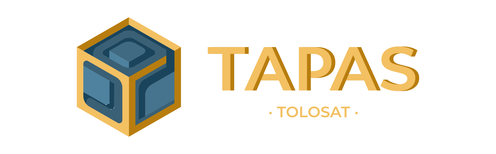

# TOLOSAT AUTONOMOUS PAYLOAD AND AVIONIC SOFTWARE

## Context 

TAPAS (TOLOSAT Autonomous Payload and Avionic Software) is the flight software for the TOLOSAT 3U nanosatellite. This software has different roles including :

- Ensuring the vital functions of the satellite: temperature management, attitude management, memory, power and computing resources management.
- Ensuring satellite - ground communication. 
- Ensuring the piloting of the payloads.

But the software must also be autonomous because it will be connected to the ground segment in Toulouse for twenty minutes a day. It must therefore be able to manage different scenarios and make decisions concerning the operation of the satellite while guaranteeing its survival.

TAPAS is based on FreeRTOS software which is an open-source real-time OS (RTOS) . It provides task management and time scheduling for low-power embedded applications. Moreover, TAPAS is designed to run on an ARM-M processor which is the architecture chosen for the on-board computer.

## Description 

TAPAS is, as mentioned in the previous paragraph, based on FreeRTOS and is intended to run on an ARM-M target. In order to be able to develop a software that can use this OS and adapt to several possible targets, it was decided to separate the source code by functionality. We distinguish three sets of functionalities:

- The core corresponds to the application part of TAPAS, it contains the main and its tasks. 
- The middleware contains high level drivers that allow to perform different tasks of the satellite such as communication with payloads or processing of TM and TC.
- The tools are all the layers on which the application is based. They include the OS, the CMSIS, the BSP and the HALs. Only the HAL TOLOSAT and BSPs are developed internally, the rest of the layers are recovered from suppliers (ARM, FreeRTOS, ST ...) that's why we defined them as submodules.

In order for each feature to be independent of the others at the time of development but to fit together at the time of compilation we have chosen the following framework:
- TAPAS's features are contained in separate folders. 
- TAPAS is based on a set of Makefiles which are responsible for compiling each of the codes and assembling them. These Makefiles are grouped in the conf folder except for the main Makefile which is located at the root.
- No IDE will be used to guarantee the evolution of the code and its porting to several targets and to avoid version compatibility problems.
- A docker containing the compiler and debugger has been created to guarantee the stability of the code and its reproducibility on several machines.
- We chose the arm-none-eabi-gcc compiler version 10.3.1, the debugger is based on gdb-multiarch version 12.1 and on openocd version 0.11.0.

**_NOTE :_**  Compiling and running outside the docker is possible but deprecated.

## Quick installation

To develop TAPAS, it is necessary to have a linux installed on your computer. The docker allows to avoid compatibility problems between linux versions but does not allow to run TAPAS under Windows or MacOS. The latter two are not recommended for developing TAPAS.

If you are on Linux and have Docker. Just clone this repository and run the command `./run-docker.sh`. The docker image should be created and then a detached docker should be created. One can either attach VSCode into the container and develop with it, or simply attach the docker to the terminal by doing docker attach {id}.

If you're on Ubuntu 22.04 and don't want to use Docker, you can install the dependencies for TAPAS using apt by doing:
- `sudo apt update && sudo apt upgrade -y`
- `sudo apt install -y git build-essential make arm-none-eabi-gcc openocd gdb-arch`

It is then recommended to download VSCode and the TAPAS extension pack, which can be found at the following address: https://github.com/TOLOSAT/flight-software-extension-pack/tree/main/outputs. Simply download the latest .vsix file and install it with VSCode.

## Quick Usage

To quickly use the software, you need to know the following commands:
- `make` or `make all` removes previously generated files, builds the software, and uploads it to the board.
- `make clean` removes all previously generated files.
- `make build` builds the software (without removing files).
- `make flash` retrieves the software image and flashes it onto the board.
- `./run-docker.sh` builds and runs the Docker container in the background.

## Tools Used

To implement this project, the following tools were used: Make to automate the build process, GCC to compile source code into executable binary code, GDB to debug the code, and OpenOCD to load the program and interface between the board and GDB. A makefile is used to define the build steps, file dependencies, and compilation options. The arm-none-eabi-gcc compiler is used to compile source files and create executable binary files for the microcontroller. The gdb (gdb-multiarch) debugger is used to debug the code running on the hardware, allowing you to trace code execution, set breakpoints, and inspect variables. Finally, OpenOCD is used to load the program onto the board and to establish an interface between the board and GDB.

## Acronyms

| Acronym | Definition                                         |
|---------|----------------------------------------------------|
| BSP     | Board Support Package                              |
| CMSIS   | Cortex Microcontroller Software Interface Standard |
| HAL     | Hardware Abstraction Layer                         |
| OS      | Operating System                                   |
| RTOS    | Real Time OS                                       |
| TAPAS   | TOLOSAT Autonomous Payload and Avionic Software    |
| TC      | TeleCommand                                        |
| TM      | TeleMeasure                                        |