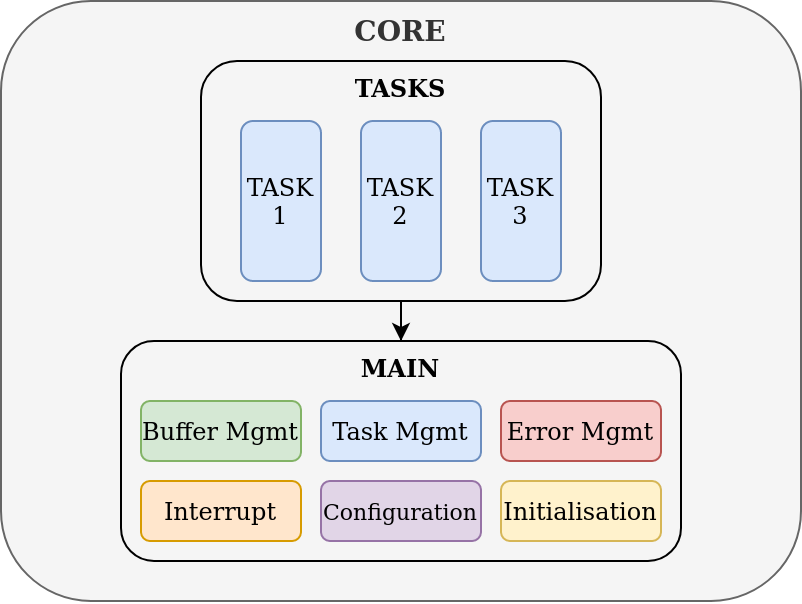

# TAPAS Application

TAPAS application is the real components of the flight software: we find there the tasks managing the software (mode management, error management, ...) the tasks managing of the avionic and the tasks managing the payloads.

