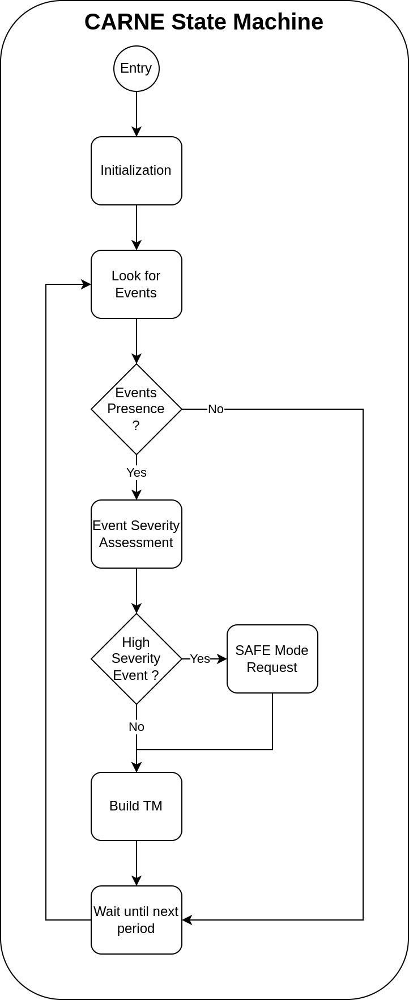

# Common Automated Recording of New Events (CARNE)

[Come back to first page](Technical_Specifications.md)

## Introduction

Common Automated Recording of New Events (CARNE), along with SALAMI and MISO, is one of the three major tasks of TAPAS. Its role is to check that the satellite is behaving as expected. In fact, events are messages that signal that the satellite is leaving or is about to leave its nominal behaviour. An event does not represent a software error, unlike what SALAMI and MISO monitor.

## Description

CARNE, like MISO, was created to avoid SALAMI being the only task to monitor. SALAMI keeps the task execution monitoring, CARNE monitors the events taking place in the satellite and MISO monitors the OS. The advantages of separating these three activities are more dynamic scheduling (SALAMI does not monopolise the time available) and more effective failure detection.

Satellite events are messages indicating that the satellite is operating at its nominal capacity. Each task generates events when :
- An observable leaves its nominal operating range.
- An error or anomaly occurs.

There are four levels of events:
1. Informative event, this event has no impact on satellite operation.
2. Low severity event, this event has a negligible impact on satellite operation.
3. Medium severity event, this event has an impact on satellite operation and requires a flight software response.
4. High severity event, this event presents a major risk for the satellite and a switch to SAFE mode is required.

Examples of these event levels are as follows:
1. The satellite is in eclipse.
2. An observable passes below/above a non-critical observation threshold.
3. The amount of mission data stored exceeds the required threshold, so data production must be stopped until it has been brought down to earth.
4. An observable falls below/above the critical threshold.

In summary, the task must :
- This task behaves in the same way regardless of its mode.
- Recovering events from other tasks.
- Check the events that have occurred and verify their criticality using an event table.
- Generate TMs containing the events.
- Generates a request to switch to SAFE mode if the event is high severity level.

The operation of CARNE task is then relatively simple and can be summarized with the following state machine :

## Failure Management

The following two tables list the types and subtypes encountered by CARNE:

| Number | Error Type | Description      |
|--------|------------|------------------|
| 0      | No Error   | No error occured |
| 1      | ...        | ...              |

| Number | Error SubType | Description      |
|--------|---------------|------------------|
| 0      | No Error      | No error occured |
| 1      | ...           | ...              |

 These two tables must be completed when the CARNE code is created. 

## Specifications

| Reference      | Name       | Rational       | Description                                         |
|----------------|------------|----------------|-----------------------------------------------------|
| T-TAPAS-300-00 | CARNE Task | T-TAPAS-052-00 | CARNE is the task responsible for event monitoring. |

| Reference      | Name                   | Rational       | Description                                           |
|----------------|------------------------|----------------|-------------------------------------------------------|
| T-TAPAS-301-00 | Carne Mode Independant | T-TAPAS-300-00 | CARNE behaves in the same way regardless of its mode. |

| Reference      | Name                  | Rational       | Description                                                                |
|----------------|-----------------------|----------------|----------------------------------------------------------------------------|
| T-TAPAS-302-00 | Carne Event Telemetry | T-TAPAS-300-00 | CARNE recovers events and converts them into TMs in compliance with PUS 5. |

| Reference      | Name           | Rational       | Description                                                                                  |
|----------------|----------------|----------------|----------------------------------------------------------------------------------------------|
| T-TAPAS-303-00 | Event Severity | T-TAPAS-300-00 | Events have four severity levels: informative, low severity, medium severity, high severity. |

| Reference      | Name                      | Rational       | Description                                                                               |
|----------------|---------------------------|----------------|-------------------------------------------------------------------------------------------|
| T-TAPAS-304-00 | CARNE Severity Assessment | T-TAPAS-300-00 | For each event, CARNE must assess the level of severity based on an event severity table. |

| Reference      | Name                    | Rational       | Description                                                         |
|----------------|-------------------------|----------------|---------------------------------------------------------------------|
| T-TAPAS-305-00 | CARNE Safe Mode Request | T-TAPAS-300-00 | If a high severity event occurs, CARNE asks to switch to SAFE mode. |
