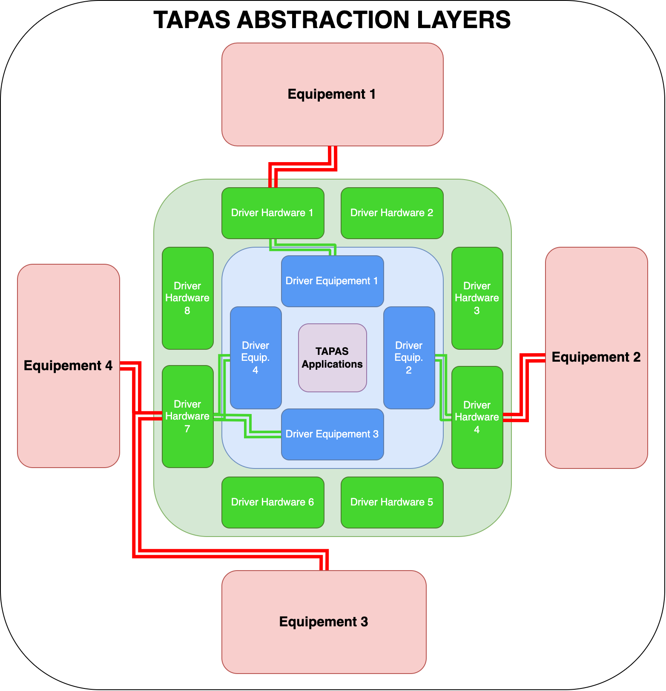

# Hardware & Software Interfaces

[Come back to first page](Technical_Specifications.md)

## Introduction

As flight software, TAPAS is designed to interface with all the platform's equipment and payloads.

## Description

It is important to specify that the operation of TAPAS must be independent of hardware equipment. To be able to work with several different types of hardware, you need :
- A hardware abstraction layer to standardise calls to microcontroller peripherals.
- An abstraction layer for controlling the equipment. This means that if a piece of equipment changes, all we have to do is adopt this layer.
- The interfaces between the abstraction layers should be as standard as possible, which guarantees the modularity of the code.

This principle can be summarised as follows :

For hardware drivers, we create a TOLOSAT Hardware Abstraction Layer (HAL) and standardise function calls:
- DrvOpen which is used to initialise the device
- DrvWrite, used to send a message via the device
- DrvRead, which is used to receive a message via the device
- DrvIoctl, used to perform micro-actions on the device (change a setting, control a specific IO, etc.).
- DrvClose to close the device

For equipment drivers, we do not impose a standard, but the equipment driver API must be independent of the hardware and be sufficient to control the equipment, but must be independent of the application.

## Specifications

| Reference      | Name              | Rational       | Description                                                                                                              |
|----------------|-------------------|----------------|--------------------------------------------------------------------------------------------------------------------------|
| T-TAPAS-500-00 | Abstraction Layer | T-TAPAS-011-00 | TAPAS needs to use abstraction layers so that it can interface with several pieces of equipment while remaining modular. |

| Reference      | Name                       | Rational       | Description                                                                                                       |
|----------------|----------------------------|----------------|-------------------------------------------------------------------------------------------------------------------|
| T-TAPAS-501-00 | Hardware Abstraction Layer | T-TAPAS-011-00 | Hardware drivers must be standardised independently of hardware by creating a TOLOSAT Hardware Abstraction Layer. |

| Reference      | Name              | Rational       | Description                                                                                                   |
|----------------|-------------------|----------------|---------------------------------------------------------------------------------------------------------------|
| T-TAPAS-502-00 | Equipment Drivers | T-TAPAS-011-00 | Each device must have its own driver which is independent of the application and is based on the HAL drivers. |