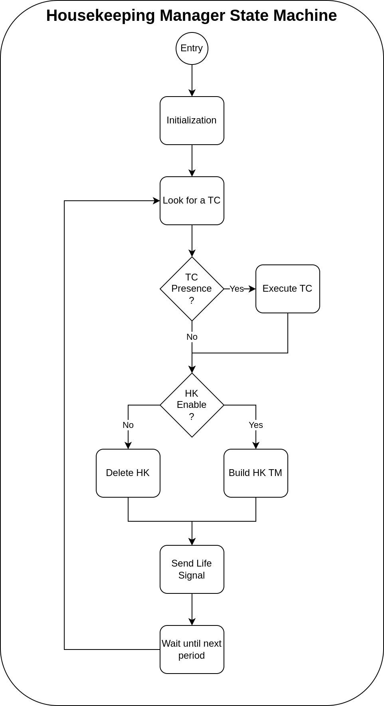

# HouseKeeping Management

[Come back to first page](Technical_Specifications.md)

## Introduction

The role of the housekeeping management team is to collect all the observables from the satellite, then package them in the form of a telemetry for descent to the ground.

## Description

The housekeeping (HK) corresponds to the values of the satellite observables at a given time. The role of the housekeeping manager is to retrieve these observables and put them into telemetry form. In addition, the ground can activate or deactivate the generation of housekeeping telemetries by telecommands (TC(3,5) and TC(3,6)). The task must :
- This task behaves in the same way regardless of its mode.
- Check whether there is a TC for activating or deactivating HK TMs.
- Recover the HK of each task, put them in the form of TM and send them to the TM sender if the HK is enabled.
- Empty the HK buffers without retaining their contents if HK is disabled.

The operation of housekeeping task is then relatively simple and can be summarized with the following state machine :

## Specifications

| Reference      | Name                 | Rational       | Description                                                               |
|----------------|----------------------|----------------|---------------------------------------------------------------------------|
| T-TAPAS-350-00 | Housekeeping Manager | T-TAPAS-053-00 | Housekeeping Manager is the task responsible for housekeeping management. |

| Reference      | Name                          | Rational       | Description                                                                   |
|----------------|-------------------------------|----------------|-------------------------------------------------------------------------------|
| T-TAPAS-351-00 | Housekeeping Mode Independant | T-TAPAS-350-00 | The housekeeping manager task behaves in the same way regardless of its mode. |

| Reference      | Name                       | Rational       | Description                                                              |
|----------------|----------------------------|----------------|--------------------------------------------------------------------------|
| T-TAPAS-352-00 | Housekeeping PUS compliant | T-TAPAS-350-00 | The housekeeping manager's TMs and TCs must be handled by PUS 3 Service. |

| Reference      | Name                              | Rational       | Description                                                                       |
|----------------|-----------------------------------|----------------|-----------------------------------------------------------------------------------|
| T-TAPAS-353-00 | Housekeeping Enabling / Disabling | T-TAPAS-350-00 | It must be possible to activate or deactivate housekeeping (PUS 3.5 and PUS 3.6). |

| Reference      | Name                | Rational       | Description                                                                     |
|----------------|---------------------|----------------|---------------------------------------------------------------------------------|
| T-TAPAS-354-00 | Housekeeping Report | T-TAPAS-350-00 | Remote housekeeping measurements will be made as a parameter report (PUS 3.25). |

| Reference      | Name                            | Rational       | Description                                                                                                     |
|----------------|---------------------------------|----------------|-----------------------------------------------------------------------------------------------------------------|
| T-TAPAS-355-00 | Housekeeping Message Retrieving | T-TAPAS-350-00 | The housekeeping manager must take housekeeping messages from other tasks and turn them into TM's (if enabled). |
