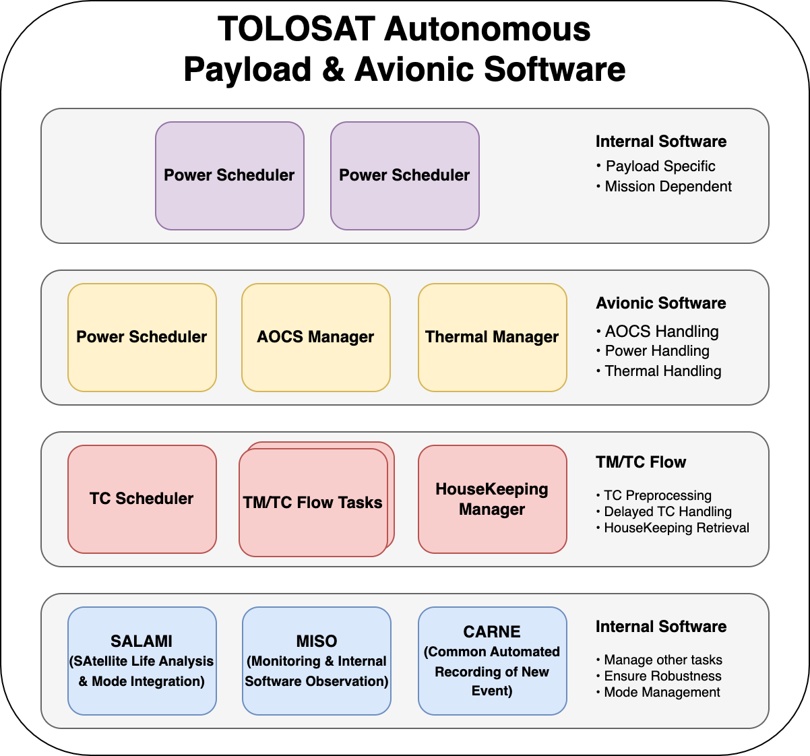
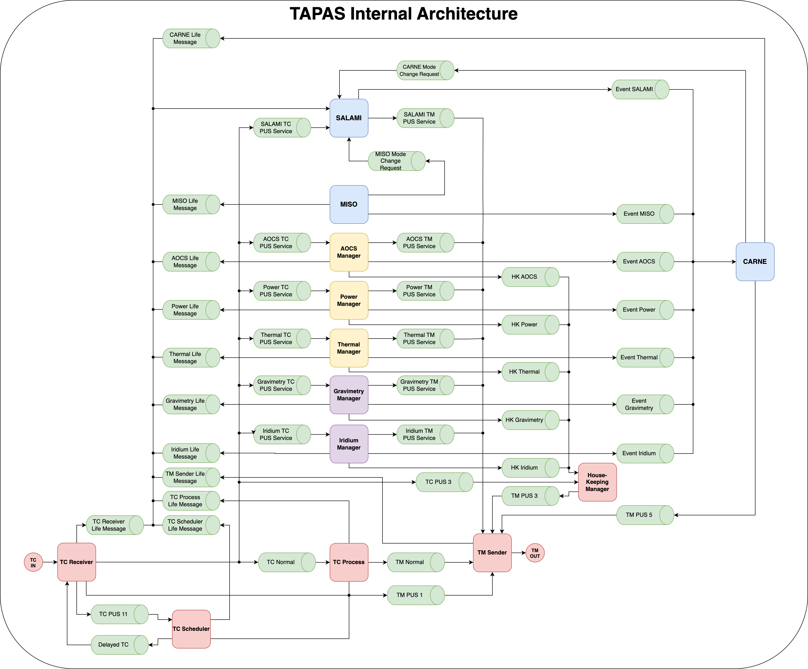
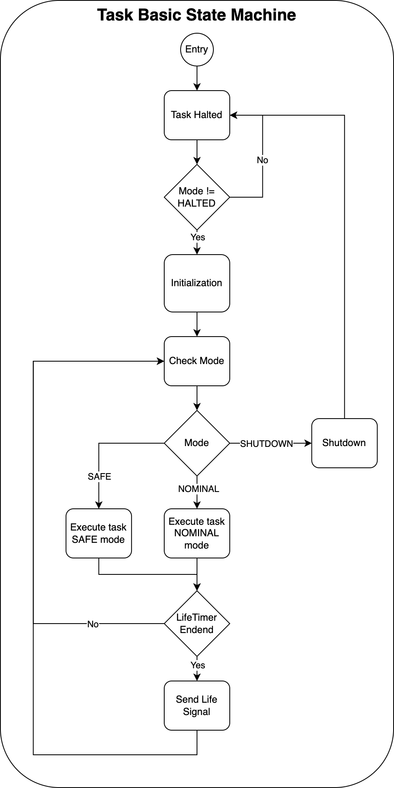

# TAPAS Internal Architecture Isolation

[Come back to first page](Technical_Specifications.md)

## Introduction

As mentioned above, TAPAS is the flight software that manages the avionic and payloads. It must function autonomously when not in visibility of the ground segment, but it must also be capable of being piloted remotely by an operator. 
TAPAS' main activities are as follows:
- Avionic management (thermal, scao, power).
- Payload management.
- Telecommand and Telemetry flow.
- Internal management.
Internal management covers all the activities that ensure the software's autonomy, performance and robustness.
## Specifications

This section contains the global specifications. The internal specifications for each activity will be specified in their respective sub-sections.

| Reference      | Name     | Rational | Description                                                               |
|----------------|----------|----------|---------------------------------------------------------------------------|
| T-TAPAS-001-00 | Autonomy | N/A      | TAPAS must be autonomous and function even in the absence of an operator. |

| Reference      | Name           | Rational | Description                                      |
|----------------|----------------|----------|--------------------------------------------------|
| T-TAPAS-002-00 | Remote control | N/A      | TAPAS can be controlled remotely by an operator. |

| Reference      | Name | Rational | Description                                                                      |
|----------------|------|----------|----------------------------------------------------------------------------------|
| T-TAPAS-003-00 | FDIR | N/A      | TAPAS must have Failure Detection, Identification and Recovery (FDIR) mechanisms |

| Reference      | Name                  | Rational | Description                                                                   |
|----------------|-----------------------|----------|-------------------------------------------------------------------------------|
| T-TAPAS-004-00 | Operator vs. Software | N/A      | The operator's decision always takes precedence over the software's decision. |

| Reference      | Name      | Rational | Description                        |
|----------------|-----------|----------|------------------------------------|
| T-TAPAS-005-00 | Safe Boot | N/A      | TAPAS must be guaranteed to start. |

| Reference      | Name        | Rational | Description                                                   |
|----------------|-------------|----------|---------------------------------------------------------------|
| T-TAPAS-006-00 | End of life | N/A      | The end-of-life of the satellite must be guaranteed by TAPAS. |

| Reference      | Name | Rational | Description                                                                                        |
|----------------|------|----------|----------------------------------------------------------------------------------------------------|
| T-TAPAS-007-00 | RTOS | N/A      | TAPAS must use a real-time OS to enable several time-constrained tasks to be executed in parallel. |

| Reference      | Name          | Rational | Description                                                                                         |
|----------------|---------------|----------|-----------------------------------------------------------------------------------------------------|
| T-TAPAS-008-00 | On Board Time | N/A      | The on-board time will be encoded using the CCSDS Unsegment time Code format (cf. CCSDS 301.0-B-2). |

| Reference      | Name            | Rational | Description                                                        |
|----------------|-----------------|----------|--------------------------------------------------------------------|
| T-TAPAS-009-00 | Reconfiguration | N/A      | TAPAS configurations can be recharged from the ground if required. |

| Reference      | Name    | Rational | Description                                                                                                        |
|----------------|---------|----------|--------------------------------------------------------------------------------------------------------------------|
| T-TAPAS-010-00 | Storage | N/A      | TAPAS data must be able to be stored on non-volatile memory when its volume is too large or needs to be backed up. |

| Reference      | Name         | Rational       | Description                                                           |
|----------------|--------------|----------------|-----------------------------------------------------------------------|
| T-TAPAS-020-00 | Adaptability | T-TAPAS-001-00 | TAPAS must have several execution modes to handle different contexts. |

| Reference      | Name       | Rational                       | Description                                                                  |
|----------------|------------|--------------------------------|------------------------------------------------------------------------------|
| T-TAPAS-021-00 | Robustness | T-TAPAS-001-00, T-TAPAS-003-00 | If an error or a certain events occur, TAPAS must change its execution mode. |

| Reference      | Name               | Rational       | Description                                            |
|----------------|--------------------|----------------|--------------------------------------------------------|
| T-TAPAS-022-00 | Autonomous Avionic | T-TAPAS-001-00 | TAPAS must ensure that avionics operate automatically. |

| Reference      | Name               | Rational       | Description                                            |
|----------------|--------------------|----------------|--------------------------------------------------------|
| T-TAPAS-023-00 | Autonomous Payload | T-TAPAS-001-00 | TAPAS must ensure that payloads operate automatically. |

| Reference      | Name         | Rational       | Description                                                 |
|----------------|--------------|----------------|-------------------------------------------------------------|
| T-TAPAS-024-00 | Data Storage | T-TAPAS-001-00 | TAPAS must be able to save its data in non-volatile memory. |

| Reference      | Name         | Rational       | Description                                                                     |
|----------------|--------------|----------------|---------------------------------------------------------------------------------|
| T-TAPAS-025-00 | PUS Protocol | T-TAPAS-002-00 | Exchanges between TAPAS and the ground must respect PUS (cf. ECSS-E-ST-70-41C). |

| Reference      | Name       | Rational       | Description                                                                                                                         |
|----------------|------------|----------------|-------------------------------------------------------------------------------------------------------------------------------------|
| T-TAPAS-026-00 | TM/TC Flow | T-TAPAS-002-00 | TMs and TCs must be managed in a continuous flow using several tasks: a reception task, several execution tasks and a sending task. |

| Reference      | Name         | Rational       | Description                                                        |
|----------------|--------------|----------------|--------------------------------------------------------------------|
| T-TAPAS-027-00 | Scheduled TC | T-TAPAS-002-00 | TCs can be stored so that they can be executed at a specific time. |

| Reference      | Name       | Rational       | Description                                             |
|----------------|------------|----------------|---------------------------------------------------------|
| T-TAPAS-028-00 | TM Storage | T-TAPAS-002-00 | TMs must be stored until the satellite becomes visible. |

| Reference      | Name         | Rational       | Description                                                                                                                     |
|----------------|--------------|----------------|---------------------------------------------------------------------------------------------------------------------------------|
| T-TAPAS-029-00 | Housekeeping | T-TAPAS-002-00 | The satellite's observables must be brought down regularly in the form of TMs to report the satellite's status to the operator. |

| Reference      | Name        | Rational       | Description                                                                   |
|----------------|-------------|----------------|-------------------------------------------------------------------------------|
| T-TAPAS-030-00 | OBT Refresh | T-TAPAS-008-00 | The on-board time must be refreshed regularly using GNSS or a remote control. |

| Reference      | Name             | Rational        | Description                                                    |
|----------------|------------------|-----------------|----------------------------------------------------------------|
| T-TAPAS-031-00 | Critical Storage | T-TAPAS-0010-00 | Critical data such as TAPAS context must be saved on the FRAM. |

| Reference      | Name       | Rational        | Description                                    |
|----------------|------------|-----------------|------------------------------------------------|
| T-TAPAS-032-00 | Large DATA | T-TAPAS-0010-00 | Large data must be saved on flash type memory. |

| Reference      | Name                              | Rational       | Description                                                                                                           |
|----------------|-----------------------------------|----------------|-----------------------------------------------------------------------------------------------------------------------|
| T-TAPAS-050-00 | Mode Management & Task Monitoring | T-TAPAS-020-00 | TAPAS must have a task that monitors the tasks and changes the satellite modes according to the state of these tasks. |

| Reference      | Name                         | Rational       | Description                                                                                              |
|----------------|------------------------------|----------------|----------------------------------------------------------------------------------------------------------|
| T-TAPAS-051-00 | Internal Software Monitoring | T-TAPAS-021-00 | TAPAS must have a task that constantly monitors the execution of the OS in order to detect errors in it. |

| Reference      | Name             | Rational       | Description                                                                    |
|----------------|------------------|----------------|--------------------------------------------------------------------------------|
| T-TAPAS-052-00 | Event Monitoring | T-TAPAS-021-00 | TAPAS must have a task that monitors the events taking place in the satellite. |

| Reference      | Name              | Rational       | Description                                                               |
|----------------|-------------------|----------------|---------------------------------------------------------------------------|
| T-TAPAS-053-00 | Housekeeping Task | T-TAPAS-029-00 | A task is to recover the housekeeping and build telemetry for the ground. |

| Reference      | Name                                     | Rational       | Description                                                                                                                                         |
|----------------|------------------------------------------|----------------|-----------------------------------------------------------------------------------------------------------------------------------------------------|
| T-TAPAS-054-00 | Internal Software and Event Misbehaviour | T-TAPAS-050-00 | The TAPAS tasks responsible for monitoring events and internal software must notify the life analysis and mode management task of any misbehaviour. |

| Reference      | Name         | Rational       | Description                                                                          |
|----------------|--------------|----------------|--------------------------------------------------------------------------------------|
| T-TAPAS-055-00 | Life Message | T-TAPAS-050-00 | All tasks must send a life message to the mode management and tasks monitoring task. |

| Reference      | Name          | Rational       | Description                                                                            |
|----------------|---------------|----------------|----------------------------------------------------------------------------------------|
| T-TAPAS-056-00 | Event Message | T-TAPAS-052-00 | All tasks must send a event message to the event management task if an event occurred. |

| Reference      | Name                 | Rational      | Description                                                                                        |
|----------------|----------------------|---------------|----------------------------------------------------------------------------------------------------|
| T-TAPAS-057-00 | Housekeeping Message | T-TAPAS-53-00 | Tasks generating housekeeping must send housekeeping messages to the housekeeping management task. |

| Reference     | Name         | Rational       | Description                                                            |
|---------------|--------------|----------------|------------------------------------------------------------------------|
| T-TAPAS-80-00 | AOCS Manager | T-TAPAS-022-00 | TAPAS must have a task that manages attitude and orbit control system. |

| Reference     | Name          | Rational       | Description                                       |
|---------------|---------------|----------------|---------------------------------------------------|
| T-TAPAS-81-00 | Power Manager | T-TAPAS-022-00 | TAPAS must have a task that manages power system. |

| Reference     | Name            | Rational       | Description                                         |
|---------------|-----------------|----------------|-----------------------------------------------------|
| T-TAPAS-82-00 | Thermal Manager | T-TAPAS-022-00 | TAPAS must have a task that manages thermal system. |

| Reference      | Name               | Rational       | Description                                             |
|----------------|--------------------|----------------|---------------------------------------------------------|
| T-TAPAS-100-00 | Gravimetry Manager | T-TAPAS-023-00 | TAPAS must have a task that manages Gravimetry Payload. |

| Reference      | Name            | Rational       | Description                                          |
|----------------|-----------------|----------------|------------------------------------------------------|
| T-TAPAS-101-00 | Iridium Manager | T-TAPAS-023-00 | TAPAS must have a task that manages Iridium Payload. |

## Description

As mentioned in the introduction, TAPAS has several activities to carry out: avionic management, payload management, telecommand and telemetry flow, internal management. In order to carry out these tasks, TAPAS relies on tasks. Each activity is made up of one or more tasks. The tasks interact with each other, in particular via buffers that store messages until they are read by the next task. This functioning can be summarised by the following graph:

The internal management of TAPAS is based on a triad:
- SALAMI (SAtellite Life Analysis & Mode Integration), whose role is to control task execution (life analysis) and manage the satellite's modes. 
- MISO (Monitoring & Internal Software Analysis), whose role is to monitor the OS.
- CARNE (Common Automated Recording of New Events), whose role is to record all satellite events.

CARNE and MISO can notify SALAMI of a problem so that it can change the satellite's mode or initiate a restart. These tasks communicate with the rest of TAPAS using buffers. Life buffers are linked to SALAMI, while event buffers are linked to CARNE.

Avionic management is based on three tasks:
- AOCS Manager, which is responsible for AOCS.
- Power Manager, which is responsible for power management.
- Thermal Manager, which is responsible for thermal management.

Payload management is based on two tasks:
- Gravimetry Manager, which is responsible for Gravimetry payload.
- Iridium Manager, which is responsible for Iridium payload.

TeleCommand (TC) and TeleMetry (TM) Flow is based on a large number of tasks:
- TC Receiver, which is responsible for receiving TCs, checking their validity, generating an acknowledgement and then sending the TC to downstream tasks.
- TC Process, which is responsible for executing all TCs that do not have a specific task.
- TC Scheduler, which is responsible for receiving TCs that are to be executed at a given time.
- TM Sender, which is responsible for retrieving TMs, packaging them in the correct format for the transmitter and then storing them until the satellite is within sight of the ground station.
- Housekeeping Manager, who is responsible for receiving the observables from the satellite and generating the housekeeping TMs.
- And finally, all the other tasks that can receive their own TCs and transmit their own TMs.

Between each of these tasks there are buffers to store the TCs and TMs while waiting for the next task to retrieve them.

We can summarise the operation of the internal software with the following graph, which shows all the tasks and the buffers that link them.

## Generic Components

### Time Management

First of all, we need to differentiate between the two TAPAS time bases:
- The OS tick count. 
- On-board time.

The tick count is a time base only used by the OS scheduler. It is used to arrange tasks and activate or deactivate them periodically. This tick count represents the number of system ticks that have occurred since TAPAS was started up, modulo 2³²-1, represented by a 32-bit positive integer. This tick has a period defined in the OS settings. This period corresponds to the elementary period during which one task cannot be interrupted by another. At the end of each period the scheduler takes over and determines which task will be executed in the next period.

On-board time (OBT) is an absolute time based on a universal time reference. In particular, it is used to coordinate actions between the ground and onboard. The disadvantage of the OBT is that it naturally derives from the time on the ground. In our case, this is due to the inaccuracy of the internal clock. This is why OBT must always be recalibrated with the time on the ground. We have chosen to use the CCSD Unsegmented time Code (CUC) standard for our OBT because it is relatively simple and compact (maximum 64 bits are required). 
The CUC is divided into 2 main fields: preamble field (P-field) and time field (T-field). 
- The P-field is used to identify which standart has been chosen. P-field is limited to one octet whose format is described as follows:
    - 0 - Extension flag: indicates whether an additional byte is added to the P-field.
    - 1 to 3 - Time code identification: indicates the selected time reference (e.g. 001 corresponds to TAI, i.e. 1 January 1958).
    - 4 to 5 - number of bytes of coarse time - 1: in our case 0b11.
    - 6 to 7 - number of bytes of fine time: in our case 0b01.
- The T-field contains the time value. In the case of the CUC, it contains two sub-fields: 
    - Coarse time which corresponds to the time in seconds elapsed since the reference time.
    - Fine time which adds a precision of 2-²⁴ to the coarse time (precision of approximately 60 ns).

The following table summarises the OBT encoding in CUC format:
<table style="border-collapse:collapse;border-spacing:0" class="tg"><thead><tr><th style="border-color:inherit;border-style:solid;border-width:1px;font-family:Arial, sans-serif;font-size:14px;font-weight:bold;overflow:hidden;padding:10px 5px;text-align:left;vertical-align:top;word-break:normal">Field</th><th style="border-color:inherit;border-style:solid;border-width:1px;font-family:Arial, sans-serif;font-size:14px;font-weight:normal;overflow:hidden;padding:10px 5px;text-align:center;vertical-align:top;word-break:normal">P-Field</th><th style="border-color:inherit;border-style:solid;border-width:1px;font-family:Arial, sans-serif;font-size:14px;font-weight:normal;overflow:hidden;padding:10px 5px;text-align:center;vertical-align:top;word-break:normal" colspan="5">T-Field</th></tr></thead><tbody><tr><td style="border-color:inherit;border-style:solid;border-width:1px;font-family:Arial, sans-serif;font-size:14px;font-weight:bold;overflow:hidden;padding:10px 5px;text-align:left;vertical-align:top;word-break:normal">Content</td><td style="border-color:inherit;border-style:solid;border-width:1px;font-family:Arial, sans-serif;font-size:14px;overflow:hidden;padding:10px 5px;text-align:center;vertical-align:top;word-break:normal">Standard</td><td style="border-color:inherit;border-style:solid;border-width:1px;font-family:Arial, sans-serif;font-size:14px;overflow:hidden;padding:10px 5px;text-align:center;vertical-align:top;word-break:normal" colspan="4">Coarse Time</td><td style="border-color:inherit;border-style:solid;border-width:1px;font-family:Arial, sans-serif;font-size:14px;overflow:hidden;padding:10px 5px;text-align:center;vertical-align:top;word-break:normal">Fine Time</td></tr><tr><td style="border-color:inherit;border-style:solid;border-width:1px;font-family:Arial, sans-serif;font-size:14px;font-weight:bold;overflow:hidden;padding:10px 5px;text-align:left;vertical-align:top;word-break:normal">Value</td><td style="border-color:inherit;border-style:solid;border-width:1px;font-family:Arial, sans-serif;font-size:14px;overflow:hidden;padding:10px 5px;text-align:center;vertical-align:top;word-break:normal">0b00011101</td><td style="border-color:inherit;border-style:solid;border-width:1px;font-family:Arial, sans-serif;font-size:14px;overflow:hidden;padding:10px 5px;text-align:center;vertical-align:top;word-break:normal" colspan="4">Time in sec</td><td style="border-color:inherit;border-style:solid;border-width:1px;font-family:Arial, sans-serif;font-size:14px;overflow:hidden;padding:10px 5px;text-align:center;vertical-align:top;word-break:normal">Sec fraction</td></tr><tr><td style="border-color:inherit;border-style:solid;border-width:1px;font-family:Arial, sans-serif;font-size:14px;font-weight:bold;overflow:hidden;padding:10px 5px;text-align:left;vertical-align:top;word-break:normal">Bits</td><td style="border-color:inherit;border-style:solid;border-width:1px;font-family:Arial, sans-serif;font-size:14px;overflow:hidden;padding:10px 5px;text-align:center;vertical-align:top;word-break:normal">0 - 7</td><td style="border-color:inherit;border-style:solid;border-width:1px;font-family:Arial, sans-serif;font-size:14px;overflow:hidden;padding:10px 5px;text-align:center;vertical-align:top;word-break:normal">8 - 15</td><td style="border-color:inherit;border-style:solid;border-width:1px;font-family:Arial, sans-serif;font-size:14px;overflow:hidden;padding:10px 5px;text-align:center;vertical-align:top;word-break:normal">16 - 23</td><td style="border-color:inherit;border-style:solid;border-width:1px;font-family:Arial, sans-serif;font-size:14px;overflow:hidden;padding:10px 5px;text-align:center;vertical-align:top;word-break:normal">24 - 31</td><td style="border-color:inherit;border-style:solid;border-width:1px;font-family:Arial, sans-serif;font-size:14px;overflow:hidden;padding:10px 5px;text-align:left;vertical-align:top;word-break:normal">32 - 39</td><td style="border-color:inherit;border-style:solid;border-width:1px;font-family:Arial, sans-serif;font-size:14px;overflow:hidden;padding:10px 5px;text-align:center;vertical-align:top;word-break:normal">40 - 47</td></tr></tbody></table>

### Life Message

Each task must send a message to the mode management and life analysis task. This life message must enable this task to find out whether :
- The other tasks are working correctly.
- An error has occurred in a task, and if so, which one.
- A task is blocked (due to the absence of a life message).

In the event of an error, this life message must make it possible to record who has a problem, what mode they were in, what the error was and when it occurred. This is why the life message contains the following fields:
- Task Reference Number: number identifying the task.
- Task Mode: the mode the task was in when the error occurred.
- Status: identifies in which situation the task is (nominal, encountered a problem, etc.).
- Time: indicates the OBT value (CUC format) at the time the error occurred.

**Note:** If there is no error, the task sends a life message when the error occurs, and not before waiting for the next execution.

The following table summarises the life message format:
<table style="border-collapse:collapse;border-spacing:0" class="tg"><thead><tr><th style="border-color:inherit;border-style:solid;border-width:1px;font-family:Arial, sans-serif;font-size:14px;font-weight:bold;overflow:hidden;padding:10px 5px;text-align:left;vertical-align:top;word-break:normal">Field</th><th style="border-color:inherit;border-style:solid;border-width:1px;font-family:Arial, sans-serif;font-size:14px;font-weight:normal;overflow:hidden;padding:10px 5px;text-align:center;vertical-align:top;word-break:normal">Task Reference</th><th style="border-color:inherit;border-style:solid;border-width:1px;font-family:Arial, sans-serif;font-size:14px;font-weight:normal;overflow:hidden;padding:10px 5px;text-align:center;vertical-align:top;word-break:normal">Task Mode</th><th style="border-color:inherit;border-style:solid;border-width:1px;font-family:Arial, sans-serif;font-size:14px;font-weight:normal;overflow:hidden;padding:10px 5px;text-align:center;vertical-align:top;word-break:normal">Status </th><th style="border-color:inherit;border-style:solid;border-width:1px;font-family:Arial, sans-serif;font-size:14px;font-weight:normal;overflow:hidden;padding:10px 5px;text-align:center;vertical-align:top;word-break:normal">Time</th></tr></thead><tbody><tr><td style="border-color:inherit;border-style:solid;border-width:1px;font-family:Arial, sans-serif;font-size:14px;font-weight:bold;overflow:hidden;padding:10px 5px;text-align:left;vertical-align:top;word-break:normal">Size</td><td style="border-color:inherit;border-style:solid;border-width:1px;font-family:Arial, sans-serif;font-size:14px;overflow:hidden;padding:10px 5px;text-align:center;vertical-align:top;word-break:normal">8 bits</td><td style="border-color:inherit;border-style:solid;border-width:1px;font-family:Arial, sans-serif;font-size:14px;overflow:hidden;padding:10px 5px;text-align:center;vertical-align:top;word-break:normal">8 bits</td><td style="border-color:inherit;border-style:solid;border-width:1px;font-family:Arial, sans-serif;font-size:14px;overflow:hidden;padding:10px 5px;text-align:center;vertical-align:top;word-break:normal">8 bits</td><td style="border-color:inherit;border-style:solid;border-width:1px;font-family:Arial, sans-serif;font-size:14px;overflow:hidden;padding:10px 5px;text-align:center;vertical-align:top;word-break:normal">48 bits</td></tr></tbody></table>

### Mode Change Request

The internal software monitoring task or the event management task can ask the mode management task to switch the satellite to safe mode. If this happens, these tasks send a message to the mode change task containing :
- Task Reference Number: number identifying the task.
- Mode Change Reason : Indicates the origin of the request.
- Time: indicates the OBT value (CUC format) at the time the mode change has been requested.

The following table summarises the mode change request:
<table style="border-collapse:collapse;border-spacing:0" class="tg"><thead><tr><th style="border-color:inherit;border-style:solid;border-width:1px;font-family:Arial, sans-serif;font-size:14px;font-weight:bold;overflow:hidden;padding:10px 5px;text-align:left;vertical-align:top;word-break:normal">Field</th><th style="border-color:inherit;border-style:solid;border-width:1px;font-family:Arial, sans-serif;font-size:14px;font-weight:normal;overflow:hidden;padding:10px 5px;text-align:center;vertical-align:top;word-break:normal">Task Reference Number</th><th style="border-color:inherit;border-style:solid;border-width:1px;font-family:Arial, sans-serif;font-size:14px;font-weight:normal;overflow:hidden;padding:10px 5px;text-align:center;vertical-align:top;word-break:normal">Mode Change Reason</th><th style="border-color:inherit;border-style:solid;border-width:1px;font-family:Arial, sans-serif;font-size:14px;font-weight:normal;overflow:hidden;padding:10px 5px;text-align:center;vertical-align:top;word-break:normal">Time</th></tr></thead><tbody><tr><td style="border-color:inherit;border-style:solid;border-width:1px;font-family:Arial, sans-serif;font-size:14px;font-weight:bold;overflow:hidden;padding:10px 5px;text-align:left;vertical-align:top;word-break:normal">Size</td><td style="border-color:inherit;border-style:solid;border-width:1px;font-family:Arial, sans-serif;font-size:14px;overflow:hidden;padding:10px 5px;text-align:center;vertical-align:top;word-break:normal">8 bits</td><td style="border-color:inherit;border-style:solid;border-width:1px;font-family:Arial, sans-serif;font-size:14px;overflow:hidden;padding:10px 5px;text-align:center;vertical-align:top;word-break:normal">8 bits</td><td style="border-color:inherit;border-style:solid;border-width:1px;font-family:Arial, sans-serif;font-size:14px;overflow:hidden;padding:10px 5px;text-align:center;vertical-align:top;word-break:normal">48 bits</td></tr></tbody></table>

### Event Message

Each task generates events when one of the observables exceeds a certain threshold. Events can be used to anticipate errors or simply to signal non-nominal satellite behaviour. If this happens, these tasks send a message to the event monitoring task containing :
- Task Reference Number: number identifying the task.
- Event Type: identifies the type of event.
- Event Subtype: used to identify the event more precisely.
- Time: indicates the OBT value (CUC format) at the time the event occurred.

The following table summarises the event message format:
<table style="border-collapse:collapse;border-spacing:0" class="tg"><thead><tr><th style="border-color:inherit;border-style:solid;border-width:1px;font-family:Arial, sans-serif;font-size:14px;font-weight:bold;overflow:hidden;padding:10px 5px;text-align:left;vertical-align:top;word-break:normal">Field</th><th style="border-color:inherit;border-style:solid;border-width:1px;font-family:Arial, sans-serif;font-size:14px;font-weight:normal;overflow:hidden;padding:10px 5px;text-align:center;vertical-align:top;word-break:normal">Task Reference Number</th><th style="border-color:inherit;border-style:solid;border-width:1px;font-family:Arial, sans-serif;font-size:14px;font-weight:normal;overflow:hidden;padding:10px 5px;text-align:center;vertical-align:top;word-break:normal">Event Type</th><th style="border-color:inherit;border-style:solid;border-width:1px;font-family:Arial, sans-serif;font-size:14px;font-weight:normal;overflow:hidden;padding:10px 5px;text-align:center;vertical-align:top;word-break:normal">Event Subtype</th><th style="border-color:inherit;border-style:solid;border-width:1px;font-family:Arial, sans-serif;font-size:14px;font-weight:normal;overflow:hidden;padding:10px 5px;text-align:center;vertical-align:top;word-break:normal">Time</th></tr></thead><tbody><tr><td style="border-color:inherit;border-style:solid;border-width:1px;font-family:Arial, sans-serif;font-size:14px;font-weight:bold;overflow:hidden;padding:10px 5px;text-align:left;vertical-align:top;word-break:normal">Size</td><td style="border-color:inherit;border-style:solid;border-width:1px;font-family:Arial, sans-serif;font-size:14px;overflow:hidden;padding:10px 5px;text-align:center;vertical-align:top;word-break:normal">8 bits</td><td style="border-color:inherit;border-style:solid;border-width:1px;font-family:Arial, sans-serif;font-size:14px;overflow:hidden;padding:10px 5px;text-align:center;vertical-align:top;word-break:normal">8 bits</td><td style="border-color:inherit;border-style:solid;border-width:1px;font-family:Arial, sans-serif;font-size:14px;overflow:hidden;padding:10px 5px;text-align:center;vertical-align:top;word-break:normal">8 bits</td><td style="border-color:inherit;border-style:solid;border-width:1px;font-family:Arial, sans-serif;font-size:14px;overflow:hidden;padding:10px 5px;text-align:center;vertical-align:top;word-break:normal">48 bits</td></tr></tbody></table>

### Housekeeping Message

Some tasks generate housekeeping. The housekeeping corresponds to the values of the satellite observables at a given time. Each task generates observables, and the housekeeping task's role is to gather them together and turn them into TMs for the ground segment. This is why the tasks must transmit their housekeeping to the ground segment via messages. These messages must contain :
- Task Reference Number: number identifying the task.
- Observable : what is observed.
- Value : value of what is observed.
- Time: indicates the OBT value (CUC format) at the time the event occurred.

The following table summarises the event message format:
<table style="border-collapse:collapse;border-spacing:0" class="tg"><thead><tr><th style="border-color:inherit;border-style:solid;border-width:1px;font-family:Arial, sans-serif;font-size:14px;font-weight:bold;overflow:hidden;padding:10px 5px;text-align:left;vertical-align:top;word-break:normal">Field</th><th style="border-color:inherit;border-style:solid;border-width:1px;font-family:Arial, sans-serif;font-size:14px;font-weight:normal;overflow:hidden;padding:10px 5px;text-align:center;vertical-align:top;word-break:normal">Task Reference Number</th><th style="border-color:inherit;border-style:solid;border-width:1px;font-family:Arial, sans-serif;font-size:14px;font-weight:normal;overflow:hidden;padding:10px 5px;text-align:center;vertical-align:top;word-break:normal">Observable</th><th style="border-color:inherit;border-style:solid;border-width:1px;font-family:Arial, sans-serif;font-size:14px;font-weight:normal;overflow:hidden;padding:10px 5px;text-align:center;vertical-align:top;word-break:normal">Value</th><th style="border-color:inherit;border-style:solid;border-width:1px;font-family:Arial, sans-serif;font-size:14px;font-weight:normal;overflow:hidden;padding:10px 5px;text-align:center;vertical-align:top;word-break:normal">Time</th></tr></thead><tbody><tr><td style="border-color:inherit;border-style:solid;border-width:1px;font-family:Arial, sans-serif;font-size:14px;font-weight:bold;overflow:hidden;padding:10px 5px;text-align:left;vertical-align:top;word-break:normal">Size</td><td style="border-color:inherit;border-style:solid;border-width:1px;font-family:Arial, sans-serif;font-size:14px;overflow:hidden;padding:10px 5px;text-align:center;vertical-align:top;word-break:normal">8 bits</td><td style="border-color:inherit;border-style:solid;border-width:1px;font-family:Arial, sans-serif;font-size:14px;overflow:hidden;padding:10px 5px;text-align:center;vertical-align:top;word-break:normal">8 bits</td><td style="border-color:inherit;border-style:solid;border-width:1px;font-family:Arial, sans-serif;font-size:14px;overflow:hidden;padding:10px 5px;text-align:center;vertical-align:top;word-break:normal">32 bits</td><td style="border-color:inherit;border-style:solid;border-width:1px;font-family:Arial, sans-serif;font-size:14px;overflow:hidden;padding:10px 5px;text-align:center;vertical-align:top;word-break:normal">48 bits</td></tr></tbody></table>

### Basic Task Operation

With the exception of certain tasks, all tasks must be based on the same operation. Standardising the way tasks operate means that there is a constant interface with the rest of the tasks, particularly the life analysis and management mode tasks. All these tasks are based on a state machine which must :
- Periodically execute the task process as defined by the mode.
- Send a life signal periodically.
- Send a housekeeping signal periodically.
- Have an initialisation state that enables the necessary hardware and software resources to be activated.
- A shutdown state to deactivate hardware and software resources.
- A stop state that automatically suspends the task. When the task is resumed by the system, it is essential to exit the shutdown state.
- At the start of each period, check which mode the job is in. **Warning**, the mode must be stored locally for the duration of the period in order to avoid untimely mode changes during execution.
- Be able to stop the task. In this case, the job must go through the shutdown state and then the stop state.  
- Move into the stop state after the task entrypoint before initialisation. Only the mode management task can order the initialisation.

There may, however, be some exceptions: some tasks does not have housekeepings and some tasks must run indefinitely from start-up. Consequently, these tasks can afford not to have a shutdown or stop state, i.e. if these tasks fail, only a hard reset can solve the problem.

The operating principle of these tasks can be summarised using the following state machine:

