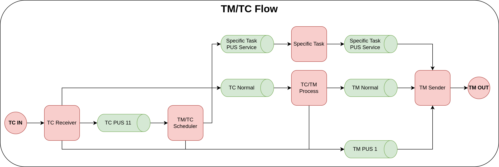

# Telemetry and Telecommand Flow

[Come back to first page](Technical_Specifications.md)

## Introduction

## Specifications

## Description

## List of PUS Services & Subservices Used

Here is a table showing all the PUS services used on TAPAS :

| Service | Name                           |
|:-------:|--------------------------------|
|    1    | Request Verification           |
|    3    | Housekeeping                   |
|    5    | Event Reporting                |
|    9    | Time Management                |
|   11    | Time Based Scheduling          |
|   15    | On-Board Storage and Retrieval |
|   17    | Test                           |
|   160   | SALAMI PUS Service             |
|   161   | MISO PUS Service               |
|   176   | AOCS PUS Service               |
|   177   | Power PUS Service              |
|   178   | Thermal PUS Service            |
|   192   | Gravimetry PUS Service         |
|   193   | Iridium PUS Service            |

Note: services above 128 are mission-specific services according to the PUS standard.

Here is a table showing all telemetries and telecommands used on TAPAS :

| Service | Subservice | TM/TC | Purpose                                            |
|:-------:|:----------:|:-----:|----------------------------------------------------|
|    1    |     1      |  TM   | Successful Acceptance                              |
|    1    |     2      |  TM   | Failed Acceptance                                  |
|    1    |     7      |  TM   | Successful Execution                               |
|    1    |     8      |  TM   | Failed Execution                                   |
|    3    |     5      |  TC   | Enable Housekeeping                                |
|    3    |     6      |  TC   | Disable Housekeeping                               |
|    3    |     25     |  TM   | Housekeeping Parameter Report                      |
|    5    |     1      |  TM   | Informative Event Report                           |
|    5    |     2      |  TM   | Low Severity Event Report                          |
|    5    |     3      |  TM   | Medium Severity Event Report                       |
|    5    |     4      |  TM   | High Severity Event Report                         |
|    9    |     2      |  TM   | CUC time report                                    |
|    9    |     xx     |  TC   | Set On-Board Time                                  |
|   11    |     1      |  TC   | Enable Time-Based Schedule                         |
|   11    |     2      |  TC   | Enable Time-Based Schedule                         |
|   11    |     3      |  TC   | Reset Time-Based Schedule                          |
|   11    |     4      |  TC   | Add Activity to the Time-Based Schedule            |
|   15    |     9      |  TC   | Start the by-time-range retrieval of packet stores |
|   17    |     1      |  TC   | Connection Test (Ping)                             |
|   17    |     2      |  TM   | Connection Test Answer (Pong)                      |

## Failure Management

The following two tables list the types and subtypes encountered by TM/TC management tasks :

| Number | Error Type | Description      |
|--------|------------|------------------|
| 0      | No Error   | No error occured |
| 1      | ...        | ...              |

| Number | Error SubType | Description      |
|--------|---------------|------------------|
| 0      | No Error      | No error occured |
| 1      | ...           | ...              |

 These two tables must be completed when TM/TC management tasks code is created. 
