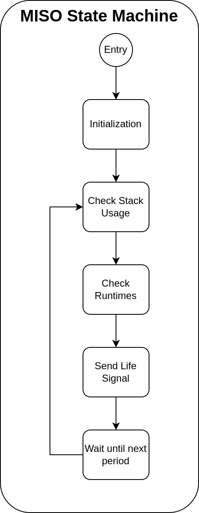

# Monitoring and Internal Software Observation (MISO)

[Come back to first page](UserManual.md)

## Introduction

Monitoring & Internal Software Observation (MISO), along with SALAMI and CARNE, is one of the three major tasks of TAPAS. His role is to check that the software is working properly. Where SALAMI checks that the tasks are working properly, MISO checks the OS.

## Specifications

| Reference      | Name      | Rational       | Description                                                    |
|----------------|-----------|----------------|----------------------------------------------------------------|
| T-TAPAS-250-00 | MISO Task | T-TAPAS-051-00 | MISO is the task responsible for internal software monitoring. |

| Reference      | Name             | Rational       | Description                                                  |
|----------------|------------------|----------------|--------------------------------------------------------------|
| T-TAPAS-251-00 | Stack Monitoring | T-TAPAS-250-00 | MISO must monitor the peak usage of the stack for each task. |

| Reference      | Name               | Rational       | Description                      |
|----------------|--------------------|----------------|----------------------------------|
| T-TAPAS-252-00 | Runtime Monitoring | T-TAPAS-250-00 | MISO must monitor tasks runtime. |

| Reference      | Name                   | Rational       | Description                                                               |
|----------------|------------------------|----------------|---------------------------------------------------------------------------|
| T-TAPAS-260-00 | Stack Monitoring Event | T-TAPAS-251-00 | MISO should generate an event when the last peak stack usage exceeds 70%. |

| Reference      | Name                         | Rational       | Description                                                                          |
|----------------|------------------------------|----------------|--------------------------------------------------------------------------------------|
| T-TAPAS-261-00 | Stack Monitoring Mode Change | T-TAPAS-251-00 | MISO must ask to switch to safe mode if a task exceeds 90% of last peak stack usage. |

| Reference      | Name                     | Rational       | Description                                                         |
|----------------|--------------------------|----------------|---------------------------------------------------------------------|
| T-TAPAS-262-00 | Runtime Monitoring Event | T-TAPAS-252-00 | MISO must generate an event when the idle CPU runtime is below 20%. |

| Reference      | Name                           | Rational       | Description                                                                 |
|----------------|--------------------------------|----------------|-----------------------------------------------------------------------------|
| T-TAPAS-263-00 | Runtime Monitoring Mode Change | T-TAPAS-252-00 | MISO must ask to switch to safe mode when the idle CPU runtime is below 5%. |

## Description

MISO, like CARNE, was created to avoid SALAMI being the only task to monitor. SALAMI keeps the task execution monitoring, CARNE monitors the events taking place in the satellite and MISO monitors the OS. The advantages of separating these three activities are more dynamic scheduling (SALAMI does not monopolise the time available) and more effective failure detection.

MISO will monitor certain metrics that could lead to an OS or TAPAS error, such as :
- Stack utilisation for each task.
- Run time of each task.

Measuring stack usage helps to prevent stack overflows. In fact, when an overflow occurs, the OS will shut down for safety reasons, as there may be memory corruption if the task has written to an area that is not its stack. Stack monitoring does two things:
- Generate events that can be traced back to a stack overflow if there is a crash.
- Anticipate a stack overflow and switch the satellite to safe mode.

Measuring the runtime of a task helps to prevent starvation. Measuring the runtime allows you to see the execution time of each task. If a task starts to take up too much CPU time, it can prevent lower-priority tasks from executing.  As with stack monitoring, runtime monitoring allows you to :
- Generate events that can be traced back to the task that is monopolising the CPU.
- Anticipate starvation and switch the satellite to safe mode.

The operation of MISO is then relatively simple and can be summarized with the following state machine :

## Failure Management

The following two tables list the types and subtypes encountered by MISO:

| Number | Error Type | Description      |
|--------|------------|------------------|
| 0      | No Error   | No error occured |
| 1      | ...        | ...              |

| Number | Error SubType | Description      |
|--------|---------------|------------------|
| 0      | No Error      | No error occured |
| 1      | ...           | ...              |

 These two tables must be completed when the MISO code is created. 
