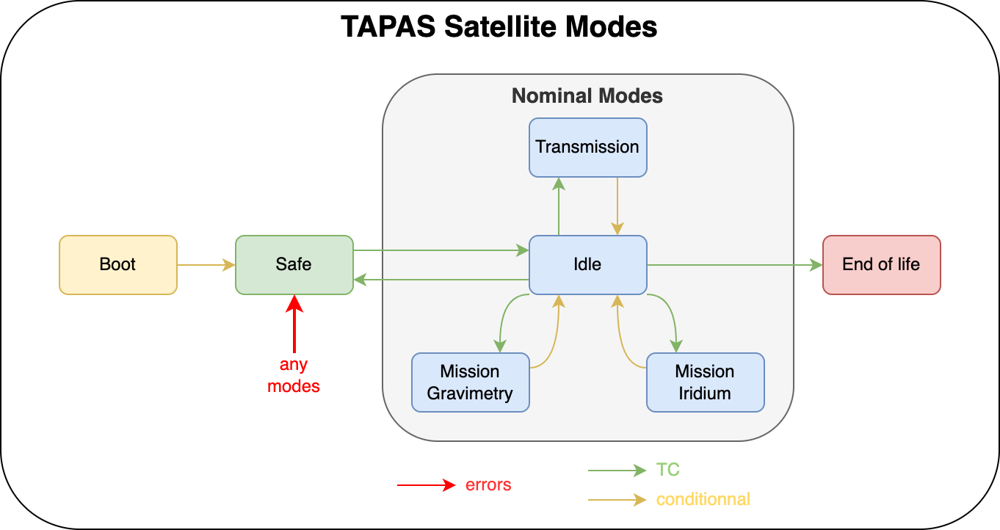
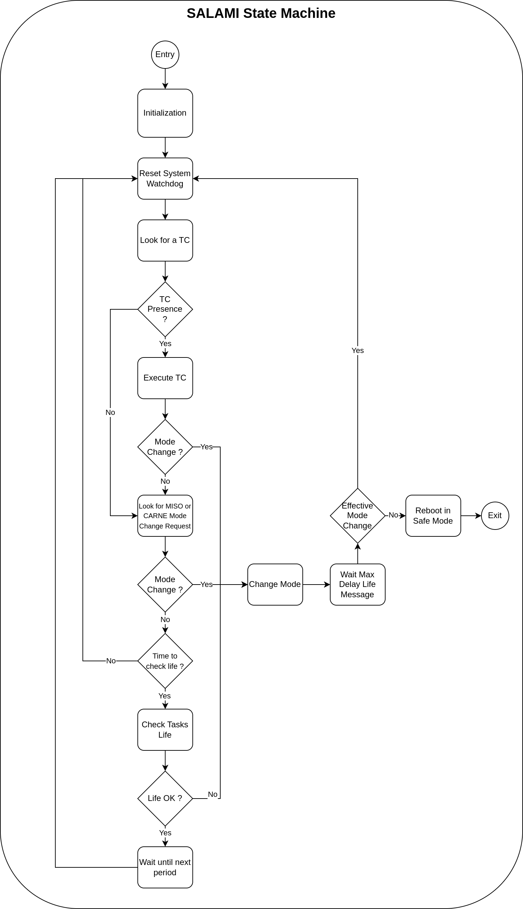

# Satellite Life Analysis & Mode Integration (SALAMI)

[Come back to first page](UserManual.md)

## Introduction

SAtellite Life Analysis & Mode Integration (SALAMI), along with MISO and CARNE, is one of the three major tasks of TAPAS. SALAMI is responsible for managing modes and managing tasks (life analysis), which is why it is the task with the highest level of permission and therefore the most critical task on the satellite.

## Specifications

| Reference      | Name        | Rational       | Description                                                          |
|----------------|-------------|----------------|----------------------------------------------------------------------|
| T-TAPAS-200-00 | SALAMI Task | T-TAPAS-050-00 | SALAMI is the task responsible for managing modes and life analysis. |

| Reference      | Name            | Rational       | Description                                                                                                      |
|----------------|-----------------|----------------|------------------------------------------------------------------------------------------------------------------|
| T-TAPAS-201-00 | Satellite Modes | T-TAPAS-010-00 | The satellite modes are : LAUNCH, SAFE, IDLE, TRANSMISSION, MISSION GRAVIMETRY, MISSION IRIDIUM and END OF LIFE. |

| Reference      | Name        | Rational       | Description                                                                 |
|----------------|-------------|----------------|-----------------------------------------------------------------------------|
| T-TAPAS-202-00 | LAUNCH Mode | T-TAPAS-010-00 | The LAUNCH mode must allow the satellite to execute the deployment actions. |

| Reference      | Name      | Rational       | Description                                                                    |
|----------------|-----------|----------------|--------------------------------------------------------------------------------|
| T-TAPAS-203-00 | SAFE Mode | T-TAPAS-010-00 | SAFE mode should enable the satellite to perform its minimum survival actions. |

| Reference      | Name              | Rational       | Description                                                                                                                            |
|----------------|-------------------|----------------|----------------------------------------------------------------------------------------------------------------------------------------|
| T-TAPAS-204-00 | TRANSMISSION Mode | T-TAPAS-010-00 | The TRANSMISSION mode must enable the satellite to send its data back down to the ground when it has visibility of the ground segment. |

| Reference      | Name                    | Rational       | Description                                                                                       |
|----------------|-------------------------|----------------|---------------------------------------------------------------------------------------------------|
| T-TAPAS-205-00 | MISSION GRAVIMETRY Mode | T-TAPAS-010-00 | The MISSION GRAVIMETRY mode is used to carry out the actions required for the gravimetry mission. |

| Reference      | Name                 | Rational       | Description                                                                                 |
|----------------|----------------------|----------------|---------------------------------------------------------------------------------------------|
| T-TAPAS-206-00 | MISSION IRIDIUM Mode | T-TAPAS-010-00 | The MISSION IRIDIUM mode is used to carry out the actions required for the iridium mission. |

| Reference      | Name             | Rational       | Description                                                                                      |
|----------------|------------------|----------------|--------------------------------------------------------------------------------------------------|
| T-TAPAS-207-00 | END OF LIFE Mode | T-TAPAS-010-00 | The END OF LIFE mode should enable actions to be carried out at the end of the satellite's life. |

| Reference      | Name           | Rational       | Description                              |
|----------------|----------------|----------------|------------------------------------------|
| T-TAPAS-208-00 | Watchdog Reset | T-TAPAS-010-00 | SALAMI has to reset the watchdog system. |

| Reference      | Name          | Rational       | Description                                                               |
|----------------|---------------|----------------|---------------------------------------------------------------------------|
| T-TAPAS-209-00 | Life Analysis | T-TAPAS-200-00 | SALAMI must receive life messages from all tasks containing their status. |

| Reference      | Name         | Rational       | Description                                                                          |
|----------------|--------------|----------------|--------------------------------------------------------------------------------------|
| T-TAPAS-210-00 | Mode Setting | T-TAPAS-200-00 | SALAMI must be able to tell the other tasks in which execution mode they should run. |

| Reference      | Name                     | Rational       | Description                                                |
|----------------|--------------------------|----------------|------------------------------------------------------------|
| T-TAPAS-211-00 | Life Message Periodicity | T-TAPAS-200-00 | SALAMI must check lifes messages at a certain periodicity. |

| Reference      | Name                 | Rational       | Description                                                                 |
|----------------|----------------------|----------------|-----------------------------------------------------------------------------|
| T-TAPAS-212-00 | Life Message Storage | T-TAPAS-200-00 | Life messages must be stored in buffers until they are processed by SALAMI. |

| Reference      | Name         | Rational       | Description                                                                                       |
|----------------|--------------|----------------|---------------------------------------------------------------------------------------------------|
| T-TAPAS-213-00 | Mode Storage | T-TAPAS-200-00 | The mode of a task must be a global variable shared between SALAMI and a task for a quick effect. |

| Reference      | Name                  | Rational       | Description                                                                                        |
|----------------|-----------------------|----------------|----------------------------------------------------------------------------------------------------|
| T-TAPAS-214-00 | Life Message Presence | T-TAPAS-200-00 | If no life message has been sent for some time, SALAMI should understand that the task is blocked. |

| Reference      | Name                 | Rational       | Description                                                                                                      |
|----------------|----------------------|----------------|------------------------------------------------------------------------------------------------------------------|
| T-TAPAS-215-00 | Life Message Content | T-TAPAS-200-00 | Life messages must tell TAPAS the mode of the task, its status (error or not) and the time at which it was sent. |

| Reference      | Name                 | Rational       | Description                                                                                  |
|----------------|----------------------|----------------|----------------------------------------------------------------------------------------------|
| T-TAPAS-216-00 | Life Message Content | T-TAPAS-200-00 | If the life message warns SALAMI of an error, SALAMI must switch the satellite to SAFE mode. |

| Reference      | Name           | Rational       | Description                                                                      |
|----------------|----------------|----------------|----------------------------------------------------------------------------------|
| T-TAPAS-217-00 | TC Mode Change | T-TAPAS-200-00 | SALAMI must be able to change the satellite mode if instructed to do so by a TC. |

| Reference      | Name            | Rational       | Description                                                                                         |
|----------------|-----------------|----------------|-----------------------------------------------------------------------------------------------------|
| T-TAPAS-218-00 | End Mode Change | T-TAPAS-200-00 | SALAMI must be able to change the satellite mode if one or more spots indicate the end of the mode. |

| Reference      | Name                                | Rational       | Description                                                                                                          |
|----------------|-------------------------------------|----------------|----------------------------------------------------------------------------------------------------------------------|
| T-TAPAS-219-00 | Internal Software SAFE MODE Request | T-TAPAS-200-00 | SALAMI must be able to change the satellite mode to SAFE if the internal software monitoring task detects a problem. |

| Reference      | Name                    | Rational       | Description                                                                                              |
|----------------|-------------------------|----------------|----------------------------------------------------------------------------------------------------------|
| T-TAPAS-220-00 | Event SAFE MODE Request | T-TAPAS-200-00 | SALAMI must be able to change the satellite mode to SAFE if the event management task detects a problem. |

| Reference      | Name                      | Rational       | Description                                                                                                  |
|----------------|---------------------------|----------------|--------------------------------------------------------------------------------------------------------------|
| T-TAPAS-221-00 | Mode Change Effectiveness | T-TAPAS-200-00 | SALAMI must ensure that the exchange mode is effective. In particular, that it does not generate any errors. |

| Reference      | Name              | Rational       | Description                                                                                               |
|----------------|-------------------|----------------|-----------------------------------------------------------------------------------------------------------|
| T-TAPAS-222-00 | Mode Change Delay | T-TAPAS-200-00 | SALAMI has to wait a while for the spots to change mode before checking that the spots have changed mode. |

| Reference      | Name            | Rational       | Description                                                                     |
|----------------|-----------------|----------------|---------------------------------------------------------------------------------|
| T-TAPAS-223-00 | Task Suspension | T-TAPAS-200-00 | SALAMI must be able to suspend tasks not used by the mode to reduce scheduling. |

| Reference      | Name                        | Rational       | Description                                                                                      |
|----------------|-----------------------------|----------------|--------------------------------------------------------------------------------------------------|
| T-TAPAS-224-00 | Mode Change Task Parameters | T-TAPAS-200-00 | Changing the mode allows SALAMI to change the execution period of a task and its priority level. |

## Description

In order to guarantee the satellite's adaptability to its context, it is based on several operating modes: LAUNCH, SAFE, IDLE, TRANSMISSION, MISSION GRAVIMETRY, MISSION IRIDIUM and END OF LIFE. These modes are described in the following graph.

The satellite first starts up, this is the BOOT, then depending on whether it is its first launch or not, we switch to LAUNCH mode or SAFE mode. LAUNCH mode enables the solar panels to be deployed and the actions to be carried out once the rocket has been deployed. SAFE mode is the mode in which the satellite's minimum functions are performed, and is intended to guarantee the satellite's safety. Then a remote control puts the satellite in IDLE mode, which is the nominal default mode: it performs more actions than SAFE mode but does not transmit data or carry out missions. We then have the MISSION GRAVIMETRY and MISSION IRIDIUM modes, which are triggered by TC and enable the satellite to carry out its missions. The TRANSMISSION mode is triggered by TC when the satellite is above the ground station and is used to send data back down to the ground. Finally, END OF LIFE mode is used to deactivate and disconnect the solar panels and drain the batteries. When an error occurs, the satellite switches to SAFE mode. If an error occurs in SAFE mode or the satellite fails to switch to SAFE, TAPAS will reboot.

SALAMI's role is to manage these modes. Mode management is based on knowledge of the context (what mode we are in), ground commands and the state of the satellite. SALAMI can only change the satellite's mode in three situations:
- The operator asks SALAMI to change mode.
- The current mode is over. The LAUNCH, MISSION GRAVIMETRY and MISSION IRIDIUM modes are ephemeral modes: they have a beginning and an end, unlike the other modes which run indefinitely.
- An error has occurred and SAFE mode must be engaged.

This is why SALAMI must regularly :
- Check for the presence of TC and then execute it or them if there are any.
- Check for MISO or CARNE mode change request.
- Check the life messages of other tasks.
- Reset the system watchdog 

When checking life messages, SALAMI must :
1. Inspect all life buffers for messages.
2. For each buffer :
    - If there is no message for a maximum waiting time for life messages, then SALAMI generates an event for CARNE, notifies an error and continues.
    - If there is an error message, then SALAMI generates an event for CARNE, notifies an error and continues.
    - Otherwise, SALAMI continues by emptying the buffer or moving on to the next buffer.
3. If an error occurred previously, then SALAMI initiates a mode change.

If a TC, CARNE or MISO asks for a mode change, then SALAMI initiates a mode change.

When changing modes, SALAMI must :
1. Change the task modes in their status variables. Resume suspended tasks.
2. Wait for a time equal to the maximum waiting time for life messages.
3. Check the status buffers and see if the tasks have changed mode and have not generated an error.
4. Check that the tasks that were supposed to be suspended have been suspended.
If the mode change encounters an error then SALAMI must restart TAPAS.

The operation of SALAMI can therefore be summarised as follows:

## Failure Management

Since SALAMI is above all the other tasks, if SALAMI encounters a problem, the risk of blocking the satellite is high. This is why, if SALAMI blocks, the watchdog will restart the satellite because SALAMI will no longer be able to reset the watchdog. If SALAMI encounters an internal problem, i.e. one that is not linked to the other tasks, then it must restart TAPAS.

Before restarting, whether due to an error or an innefective change mode, SALAMI must be able to keep track of the reason for its restart by writing it to volatile memory. 

When it is initialised, SALAMI must generate a housekeeping TM indicating the reason for its restart.